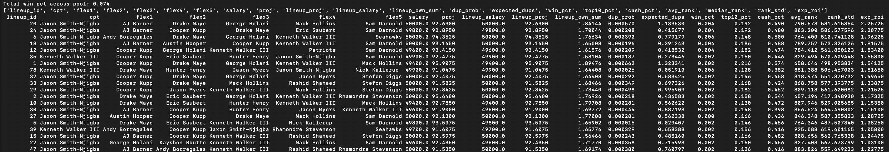
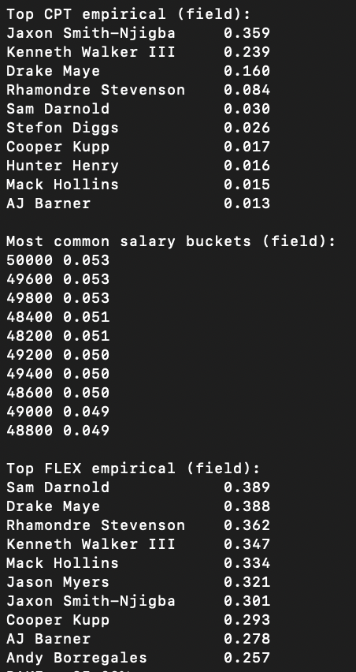

# DFS Showdown Simulation Engine

Monte Carlo simulation engine for modeling lineup performance, ownership dynamics, and ROI under uncertainty in probabilistic environments.

---

## Overview

This project simulates thousands of possible lineup outcomes to evaluate strategy, risk, and expected value-based decision making.

The system incorporates player performance distributions, ownership dynamics, and lineup construction constraints to generate realistic outcome scenarios and identify optimal lineup structures.

---

## Key Features

- Simulates lineup outcomes using Monte Carlo methods  
- Models player performance variability and game environments  
- Incorporates projected ownership and duplication dynamics  
- Evaluates ROI, win rates, and risk profiles  
- Analyzes lineup construction patterns including salary allocation  

---

## Example Output

Example simulation output showing player exposure, salary distribution, and optimal lineup tendencies:

### Summary Output


The model generates both high-level strategic insights and detailed lineup-level outputs:

### Detailed Simulation Results


---

## Tech Stack

- Python  
- NumPy  
- Pandas  

---

## How to Run

```bash
python run.py --config config/baseline.yaml --seed 1
